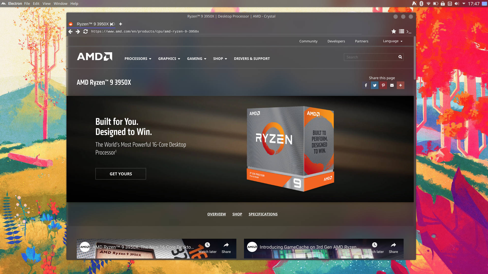

# Flux Browser

## Introduction

Welcome to Flux Browser, an innovative web browser built with ElectronJS! Flux Browser offers a modern browsing experience with customizable features, seamless integration, and robust security.

Read our final project blog article [here](https://medium.com/@alfred.nti466/crafting-the-future-building-a-custom-web-browser-with-electronjs-990e4efdd9ac). Connect with the author on LinkedIn: [Alfred](https://www.linkedin.com/in/alfred-nti/).

## Installation

To install Flux Browser, follow these steps:

1. Clone this repository: `git clone https://github.com/Freddywhest/flux-browser.git`
2. Navigate to the project directory: `cd flux-browser`
3. Install dependencies: `npm install`

## Usage

After installation, you can run Flux Browser using the following command:

```
npm start
```

## Contributing

Contributions are welcome! Please follow these guidelines:

1. Fork the repository
2. Create a new branch: `git checkout -b feature-name`
3. Make your changes and commit them: `git commit -m 'Add some feature'`
4. Push to the branch: `git push origin feature-name`
5. Submit a pull request

## Related Projects

## Related Projects

Check out these related projects:

- [Electron Mail](https://github.com/electron/electron-mail) - A simple email client built with ElectronJS.
- [Atom](https://github.com/atom/atom) - A hackable text editor for the 21st century, built on Electron.


## Licensing

This project is licensed under the [MIT License](LICENSE).

## What It Looks Like

